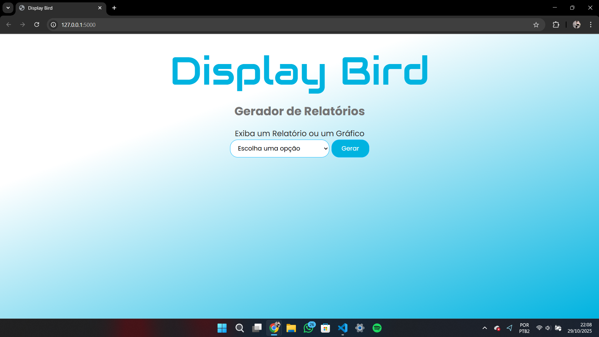

🚀 Display Bird: Gerador de Relatórios e Gráficos
O Display Bird é uma aplicação web completa desenvolvida em Python, que transforma uma planilha de dados brutos (bigData.xlsx) em relatórios e gráficos de Business Intelligence sob demanda. A interface web permite ao usuário selecionar o tipo de análise desejada, e o backend (Flask + Pandas) processa os dados, gera um novo arquivo .xlsx (seja um relatório ou um gráfico) e o disponibiliza para download imediato.

✨ Funcionalidades
O sistema é capaz de ler múltiplas abas de um arquivo Excel, consolidar os dados e gerar as seguintes análises:

Relatório Completo: Gera um arquivo .xlsx contendo todos os dados de todas as abas, após uma limpeza (dropna) para remover linhas incompletas.

Relatório de Funcionários: Gera um arquivo .xlsx focado nas colunas "Funcionário" e "Data do Exame", removendo linhas onde esses dados específicos estão ausentes.

Relatório de Exames: Filtra e gera um relatório focado nas colunas "Exames" e "Data do Exame".

Relatório por Função: Filtra e gera um relatório focado nas colunas "Função" e "Data do Exame".

Gráfico Top 15 Funções: Analisa todos os dados, conta a frequência de cada "Função", gera um gráfico de barras horizontal (com Matplotlib) com as "Top 15" e salva este gráfico dentro de um novo arquivo .xlsx (usando Openpyxl).

🛠️ Tecnologias Utilizadas
Este projeto combina tecnologias de frontend, backend e ciência de dados:

Backend (Servidor):

Python 3.11.0: A linguagem principal.

Flask: Micro-framework web responsável por:

Servir a página HTML (render_template).

Definir as rotas (@app.route).

Receber os dados do formulário (request).

Enviar os arquivos gerados para download (send_file).

Processamento de Dados e Gráficos:

Pandas: A principal ferramenta para ler, concatenar, filtrar (dropna) e manipular os dados do Excel.

Matplotlib: Usada para criar e estilizar os gráficos.

Openpyxl: Usada para criar um novo arquivo Excel "em branco" e inserir a imagem do gráfico (.png) dentro dele.

io (BytesIO): Usado como um "arquivo temporário" na memória RAM para salvar a imagem do gráfico antes de passá-la para o Openpyxl.

Frontend (Interface):

HTML5: Estrutura semântica da página (incluindo a tag <form>).

CSS3: Estilização completa, incluindo:

Flexbox: Para centralizar e alinhar os elementos.

Media Queries: Para garantir que o layout seja responsivo e funcione bem em celulares (max-width: 768px).

Google Fonts: Para as fontes personalizadas ("Audiowide" e "Poppins").

Ambiente:

Virtual Environment (.venv): Para isolar as bibliotecas (Flask, Pandas, etc.) do sistema.

📁 Estrutura do Projeto
O projeto segue a estrutura padrão do Flask, que separa a lógica, os templates e os arquivos estáticos:

/bigdata.py/
│
├── .venv/                   # Pasta do ambiente virtual com as bibliotecas
├── static/
│   └── estilizacao.css      # Nosso arquivo de estilo (CSS)
│
├── templates/
│   └── principal.html       # Nosso arquivo de interface (HTML)
│
├── app.py                   # O "cérebro" - Servidor Flask e rotas
├── relatorios_graficos.py   # O "trabalho pesado" - Funções com Pandas e Matplotlib
├── bigData.xlsx             # O arquivo de dados brutos
└── README.md                (Este arquivo)
⚙️ Como Executar o Projeto Localmente
Clone o repositório:

Bash

git clone [https://github.com/moacirjr1007/bigdata.py.git]
cd bigdata.py
Crie e ative o ambiente virtual:

Bash

# Criar
python -m venv .venv

# Ativar (Windows PowerShell)
.\.venv\Scripts\Activate.ps1

# Ativar (Linux/Mac)
source .venv/bin/activate
Instale as dependências: (Você pode criar um arquivo requirements.txt ou instalar manualmente)

Bash

pip install Flask pandas matplotlib openpyxl
Execute o servidor Flask:

Bash

python app.py
Acesse no seu navegador: Abra o seu navegador e vá para http://127.0.0.1:5000